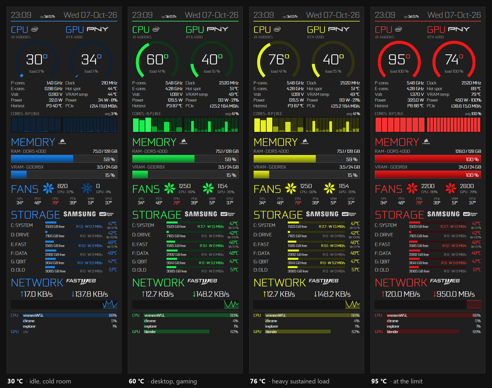

#  paxpanel

A standalone sensor panel for a 400×1280 mini-monitor on Windows. It fills the
little screen edge to edge (taskbar included), or runs as a normal window when
the mini-monitor isn't connected, and shows, once a second:

- **CPU and GPU** temperature gauges with load, clocks (P-cores and E-cores
  separately), voltage, power, the hottest core, GPU hot spot, VRAM temperature,
  power as % of the card's limit and PCIe traffic
- **Load on every CPU core** (8 P-cores, 16 E-cores on an i9-14900KS)
- **RAM and VRAM** usage
- **Fans** as little spinning fans whose speed follows the real RPM, plus the
  motherboard's temperature sensors
- **Every drive**: free space, temperature, live read/write speed and SSD wear;
  USB sticks and other drives appear by themselves when plugged in
- **Network** traffic with a 60-second graph
- **The three processes using the most CPU** and **the one using the most GPU**

The accent colour follows the CPU temperature, so you can tell how hard the
machine is working from across the room:

<p align="center"></p>

| CPU temperature | Colour |
|---|---|
| 35 °C or less | blue |
| 60 °C | green |
| 75 °C | yellow-orange |
| 90 °C or more | red (the 14900KS throttles at 100 °C) |

Colours in between blend smoothly, and the temperature is smoothed over about ten
seconds so the panel drifts from one colour to the next instead of flickering.

It is the successor of my "Cronoghirian" AIDA64 SensorPanel, but needs no AIDA64
at all. Sensors come from
[LibreHardwareMonitor](https://github.com/LibreHardwareMonitor/LibreHardwareMonitor)
and Windows itself; the panel is drawn with HTML/CSS in a WebView2 window. It uses
about 1% of the CPU.

## Requirements

- Windows 10/11 x64
- [.NET 8 Desktop Runtime](https://dotnet.microsoft.com/download/dotnet/8.0) (the SDK to build)
- [Microsoft Edge WebView2 Runtime](https://developer.microsoft.com/microsoft-edge/webview2/) (built into Windows 11)
- [PawnIO](https://pawnio.eu/) driver for CPU, motherboard and fan sensors: `winget install namazso.PawnIO`

## Build

```powershell
# 1. Fonts and logos are not in this repo; copy your own into webssets
.\scriptsetch-assets.ps1 -Source 'D:\path	o\your\icons'
# 2. Build PaxPanel.exe into the project folder and put a "paxpanel" shortcut on the desktop
.\scriptsuild.ps1            # add -NoShortcut to skip the shortcut
```

## Run

Double-click `PaxPanel.exe` (or the desktop shortcut) and accept the Windows
administrator prompt: the CPU temperature, power and fan sensors need it. Nothing
starts automatically with Windows.

- **Mini-monitor connected:** the panel goes full screen on it.
- **Mini-monitor not connected:** it opens as a normal window on the main monitor,
  which you can move, resize and close. If the mini-monitor appears later, the
  panel moves onto it; if it disappears, the panel turns back into a window.
- **To close it:** right-click the panel → **Exit** (or the window's ×).

Only one copy runs at a time. `PaxPanel.exe` reads `config.json` and the `web`
folder next to it, so it must stay in the project folder.

## Configure

Edit `config.json` in the project folder, then right-click the panel → **Reload**:

| Key | What it does |
|---|---|
| `monitor` | Target screen: by size (`width`×`height`) or by `deviceName` such as `\\.\DISPLAY4` |
| `cpu`, `gpu`, `memory` | Titles, model subtitles, logos, RAM/VRAM type |
| `fans` | Up to 4 fans: `label`, `match` = sensor name from `--dump-sensors`, optional `maxRpm` (otherwise learned) |
| `board` | Motherboard temperature sensors to show, with your own labels |
| `drives` | Drives always shown, in order, with your labels; other drives appear below them (`maxExtraDrives`) |
| `network` | Adapter (substring of its description) and ISP logo |
| `refreshMs` | Update interval in milliseconds |

Each fan's maximum speed is learned: the highest RPM seen, or, when the fan
reports its duty cycle (like the GPU's), RPM ÷ duty. Learned values are kept in
`%LOCALAPPDATA%\paxpanel\fanmax.json`.

Useful command-line switches:

- `PaxPanel.exe --dump-sensors`: writes every sensor name to `%LOCALAPPDATA%\paxpanel\sensors.txt` (run as administrator).
- `PaxPanel.exe --windowed`: always runs as a normal window, even with the mini-monitor connected.
- `PaxPanel.exe --screenshot out.png`: saves a 400×1280 picture of the panel and exits.

To preview or restyle the page without the app, serve the `web` folder and open
`index.html?mock` (also `?mock=idle`, `max`, `nulls`, `usb3`, `usb5`, `long`, `v1`, `sweep`;
add `&temp=70` to fix the CPU temperature).

## Thanks

To **Andrea "Pax" Paci**, for the original idea of buying a mini-monitor, which
then forced me to write a sensor panel to use it.

## License

MIT for the code. Fonts and logos are not included; they belong to their
respective owners.
