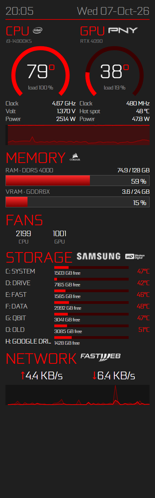

# paxpanel

A standalone sensor panel for a 400×1280 mini-monitor on Windows: CPU and GPU
temperature gauges, clocks, power, RAM and VRAM, fans, every drive (with
temperatures, plus any USB drive you plug in) and network traffic. It is
inspired by my earlier "Cronoghirian" AIDA64 SensorPanel, but needs no AIDA64
at all. Sensors come from [LibreHardwareMonitor](https://github.com/LibreHardwareMonitor/LibreHardwareMonitor)
and the panel is drawn with HTML/CSS in a WebView2 window.

<p align="center"></p>

## Requirements

- Windows 10/11 x64
- [.NET 8 Desktop Runtime](https://dotnet.microsoft.com/download/dotnet/8.0) (the SDK to build)
- [Microsoft Edge WebView2 Runtime](https://developer.microsoft.com/microsoft-edge/webview2/) (built into Windows 11)
- [PawnIO](https://pawnio.eu/) driver for CPU, motherboard and fan sensors: `winget install namazso.PawnIO`

## Install

```powershell
# 1. Fonts and logos are not in this repo; copy your own into web\assets
.\scripts\fetch-assets.ps1 -Source 'D:\path\to\your\icons'
# 2. Build, install to .\publish and start at every logon (run as administrator)
.\scripts\install.ps1
```

`install.ps1` registers a scheduled task named `paxpanel` that starts the panel
at logon with administrator rights (needed by the sensor driver), so there is
no UAC prompt at each boot. `.\scripts\uninstall.ps1` removes it.

## Configure

Edit `publish\config.json`, then right-click the panel → **Reload**:

| Key | What it does |
|---|---|
| `monitor` | Target screen: by size (`width`×`height`) or by `deviceName` such as `\\.\DISPLAY4` |
| `cpu`, `gpu`, `memory` | Titles, model subtitles, logos, RAM/VRAM type |
| `fans` | Up to 4 fans: `label` shown on the panel, `match` = sensor name from `--dump-sensors` |
| `drives` | Drives always shown, in order, with your labels; other drives appear below them automatically (`maxExtraDrives`) |
| `network` | Adapter (substring of its description) and ISP logo |
| `refreshMs` | Update interval in milliseconds |

Useful command-line switches:

- `PaxPanel.exe --dump-sensors`: writes every sensor name to `%LOCALAPPDATA%\paxpanel\sensors.txt` (run as administrator).
- `PaxPanel.exe --windowed`: runs in a normal window, for testing.
- `PaxPanel.exe --screenshot out.png`: saves a 400×1280 picture of the panel and exits.

To preview or restyle the page without the app, serve the `web` folder and open
`index.html?mock` (also `?mock=nulls`, `usb3`, `usb5`, `long`, `max`).

## Thanks

To **Andrea "Pax" Paci**, for the original idea of buying a mini-monitor, which
then forced me to write a sensor panel to use it.

## License

MIT for the code. Fonts and logos are not included; they belong to their
respective owners.
